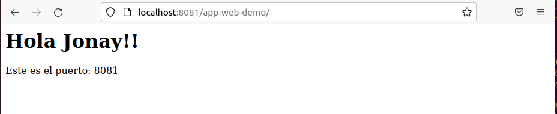

# Clustterizando un App con WildFly


## 1. Introducción.
En esta guiá vamos a ver como tener dos servidores con WildFly en Cluster. La infraestructura nos va a estar formada por grupos que a su vez estarán formados por n servidores según los vayamos necesitando, en este caso va a ver el grupo de despliegue de aplicaciones que estará formado por varios servidores con WildFly en forma de Cluster. Los grupos serán administrado de forma independiente y cada servidor podrán ser configurado desde un único archivo.

La mejor forma de realizar el despliegue en cluster, es usando la tecnología Docker. Y ademas usaremos Docker Compose que nos permitirá controlar varios contenedores y realizar configuración en ellos, esto nos permitirá construir un cluster a nuestra medida.

## 2. Construcción.
Primero vamos a preparar la aplicación que vamos a ejecutar en nuestro servidor para ello descargamos el [proyecto](https://github.com/jpexposito/docencia/tree/master/COMUN/ejemplos/java/app-web-demo) y lo modificamos.


Cambiar en el **web.xml**, sustituyendo **nombre** por el nombre del que lo este realizando.
```
<display-name>app-web-nombre</display-name>  
```


Realizar lo mismo en el **pom.xml**.


Y en el **index.jsp**.


Con esto realizado vamos a lanzar el proyecto. Para ello lanzamos el siguiente comando dentro del directorio del proyecto.
```
mvn clean install
```


Ahora vamos a probar si la aplicación funciona ejecutándola en modo local.
```
mvn clean jetty:run
```


Y lo comprobamos


Paramos de ejecutar la aplicación.


## 3. Clusterizando con Docker.
Primero se necesitaría crear un fichero Dockerfile que es que se usara para crear las imágenes de cada contenedor que despleguemos. En este caso el fichero Dockerfile viene con la aplicación y como se puede ver se esta copiando el fichero .war dentro de **deployments** y posteriormente se realiza el arranque en cluster.


Ahora toca crear el fichero **docker-compose.yml** para construir el cluster. Vemos crear creamos dos servidores (wildlfy1 y wildfly2) con distintos puertos y todos esto en la misma subred (wildfly_network).


Con esto, para poder crear el cluster lanzamos el siguiente comando:
```
docker-composer up
```


Comprobamos con docker los contenedores desplegados.


Luego comprobamos accediendo al puerto con localhost:8080 y localhost:8081 en un navegador.


Y luego añadimos /web-app-demo para acceder a la aplicación.



