# Construcción de un servicio de empresa

## 1. Introducción.
En esta guiá vamos a ver como preparar y configurar un entorno para un empresa usando Docker. Este entrono esta formado por una pagina web, una base de datos y un servicio sftp.

En este caso se va prepara el entorno en un servidor Ubuntu 20.04 con Apache + PHP. Por esto no se crearan contenedores de Apache ni PHP pero lo único que habría que hacer en caso de querer es buscar una imagen de Apache+PHP y añadirle el fichero de configuración del dominio que se mostrar mas adelante.

Los requisitos para realizar esta guiá son disponer de un servidor con Apache, PHP, Docker y Docker-Compose instalados.

## 2. Construcción.

Primero vamos a crear la estructuras de carpetas para nuestro dominio. Para ello en este caso al final nos quedara de la siguiente manera.

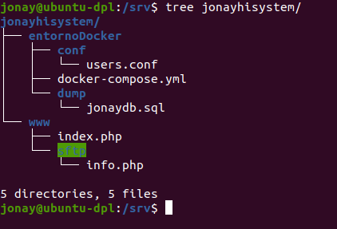

Donde:
* entornoDocker: sera la carpeta donde tendremos el fichero del docker-compose y las carpetas con los ficheros necesario para levantar los contenedores
* www: se la carpeta de la pagina web

Ahora vamos a crear poco a poco los ficheros.

### Docker-compose
Como vimos la carpeta del entrono esta formada por los fichero para desplegar los contenedores. Aquí vamos a definir lo siguiente:
* conf: en esta carpeta pondremos archivos .conf que necesiten los contenedores, en este caso solo contendrá el fichero con los usuario para el sftp
* dump: en esta carpeta tenemos el fichero .sql con la base de datos que se va a crear en el conteneodor mysql.

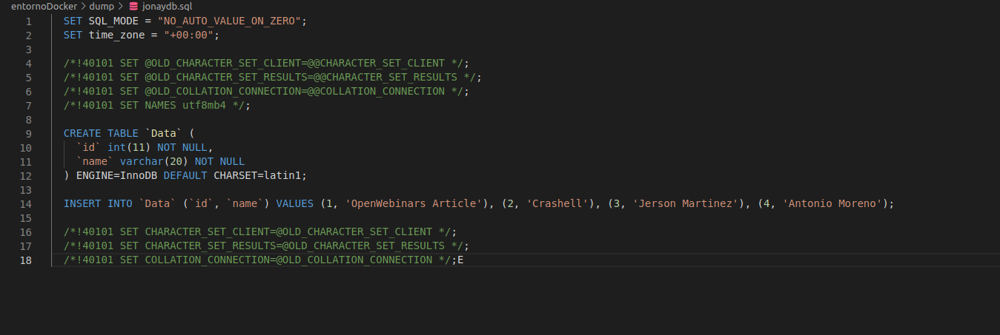

*  Y el fichero docker-compose.yml donde se define la configuración, puertos y mapeado de carpetas de los contenedores.

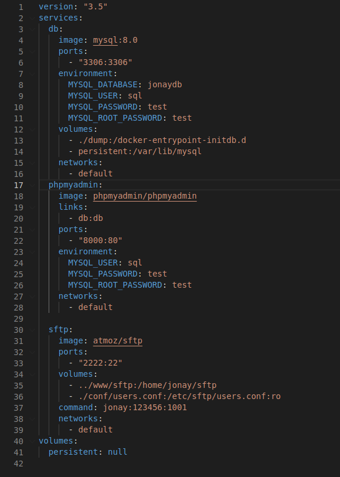

### Dominio
Ahora vemos a crear el dominio con nuestra página web. Primero como vimos en la estructura del procto vamos a tener una carpeta www que sera la raiz de nuestra pagina web donde tendremos:
* index.php: nuestra paginaweb
* sftp: sera la carpeta para el usuario sftp.
      

**Index.php**

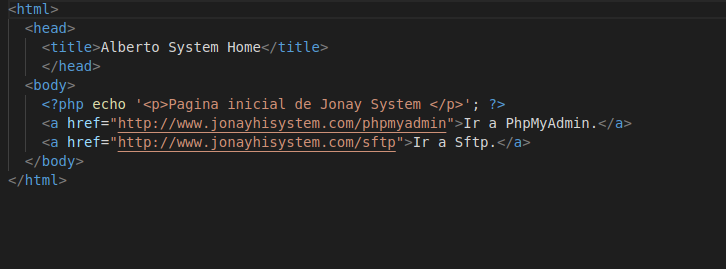

Con esto aclarado vamos a crear nuestro dominio, para ello vamos a añadir el nombre de dominio en el fichero “/etc/hosts”.
En nuestro caso sera www.jonayhisystem.com ó  jonayhisystem.com .

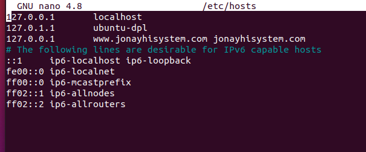

Luego de esta vamos a crear el archivo conf en Apache. Vamos a “/etc/apache2/site-available” y creamos nuestro archivo.

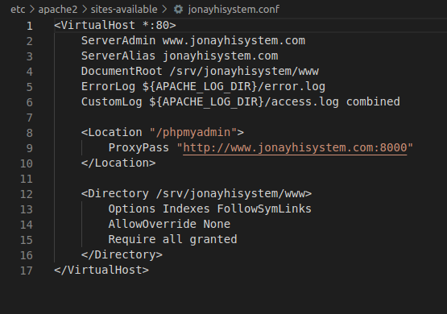

En el fichero que hemos creado podemos ver:
* ServerAdmin: nombre del dominio que tiene que coincidir con el del fichero “/etc/hosts”.
* ServerAlias: lo mismo pero con el nombre de dominio extra.
* DocumentRoot: la ruta donde tenemos www.
* Location: para acceder al phpmyadmin
* Directory: donde declaramos un directorio de la maquina para que puede acceder.

Luego de crearlo lanzamos el comando 

`sudo a2ensite jonayhisystem.conf`

## 3. Despliegue.
Desplegamos los contenedores.

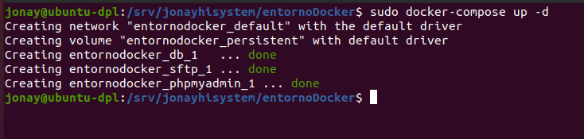

Comprobamos que están en ejecucion.

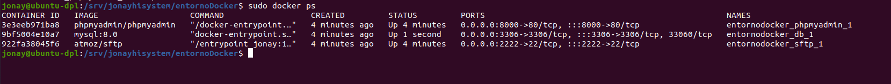

Ahora accedemos a nuestra pagina web.

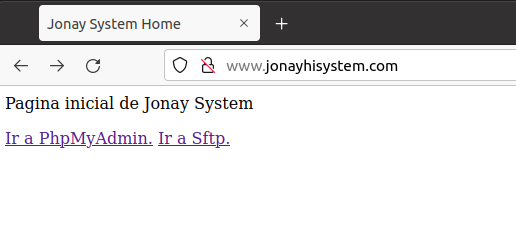

**La configuración de apache debería permitir enmascarar la url a la hora de acceder a localhost:8000, no se ha podido solucionar porque al usar proxyPass phpmyadmin se conecta y funciona pero la pagina se queda en blanco. Por esta razón las siguientes capturas son usando Redirect en vez de ProxyPass**

**Vamos a phpmyadmin.**
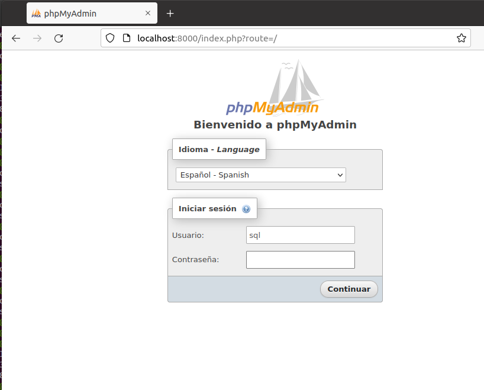

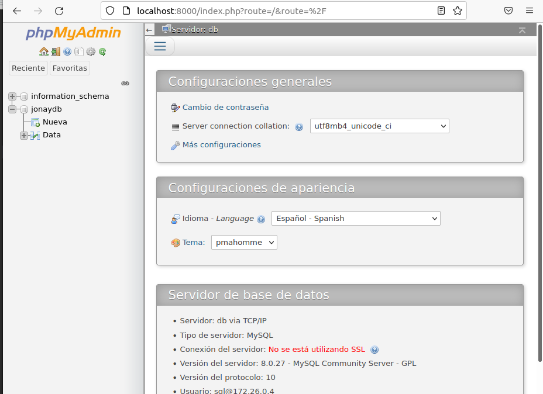

**Y ahora accedemos a /sftp**

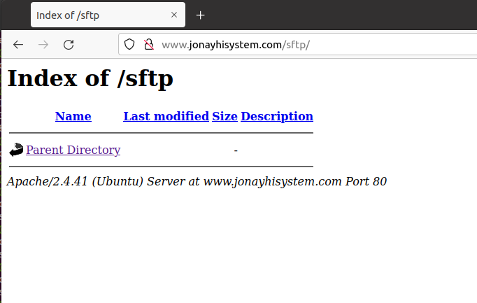

Como vemos no hay nada, vamos a conectarnos desde un cliente usando Filezilla para acceder por sftp y añadir un archivo que nos debería aparecer en la página.
Nos conectamos con sdtp://ip-servidor, usuario, contraseña y puerto.

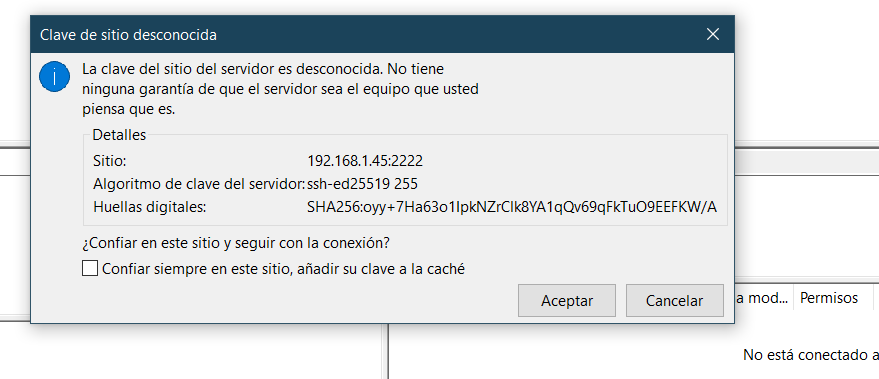

Nos conecta y vemos la carpeta sftp por defecto.

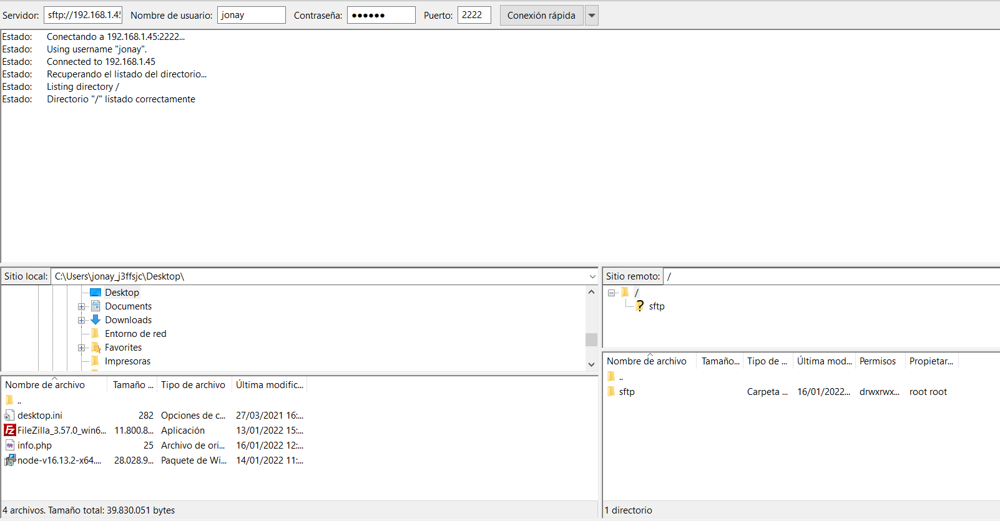

Subimos un archivo.

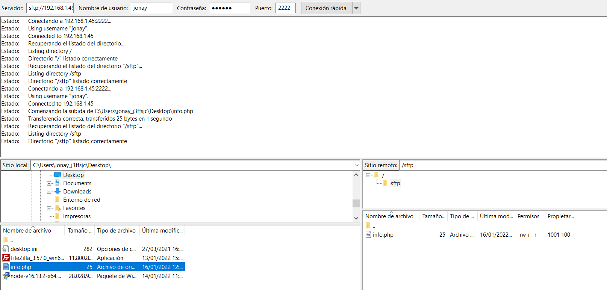

Recargamos la página /sftp.

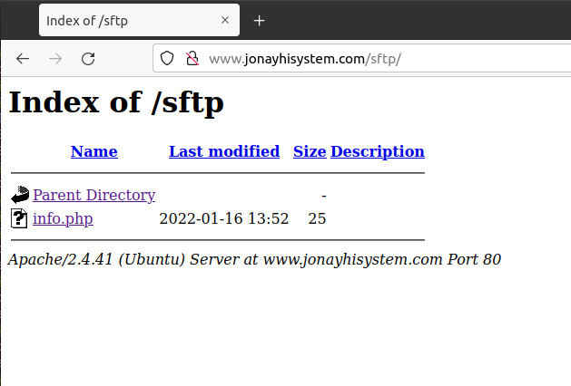
