# Desplegar una aplicación en Node.js en Docker


## 1. Introducción.
En esta guiá se va a ver como desplegar un contenedor con Node.js . Primero creamos la aplicación node, luego creamos una imagen propia y posteriormente desplegaremos el contenedor usando la imagen creada.

## 2. Crear aplicación Node.js
Primer vamos a crear un directorio para añadir los fichero que vamos a crear. En este directorio vamos a crear un fichero package.json con las dependencias de la aplicación.

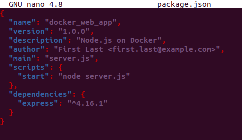


Ahora vamos a lanzar npm install. Tener en cuanta que necesitamos tener instalado npm con la versión 5 o superior.

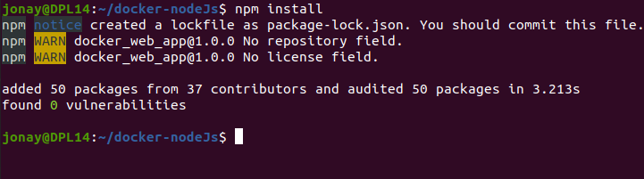


Ahora vamos a crear un fichero server.js que nos definirá la aplicación Web usando Express frameworlk:

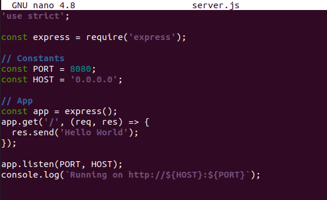


Ya con esto vamos a continuar con la creación de la imagen de docker.

## 3. Crear contenedor.
Vamos a desplegar en contenedor y para ello necesitamos una imagen. Para crear la imagen vamos a crear el fichero Dockerfile.

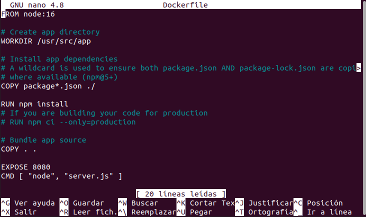


Lo importante es que vamos a instalar npm y mover los archivos que tenemos en nuestro directorio.

También vamos a crear un .dockerignore para prevenir que módulos locales y los log debug se pasen al contenedor.

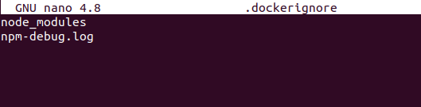


Y con esto vamos a crear la imagen. Para ello usamos el comando build y definimos el nombre que va a tener la imagen.

```
docker build . -t <your username>/node-web-app
```

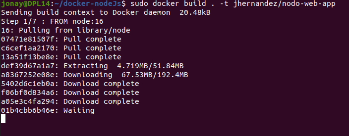


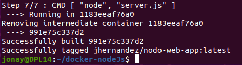

Ya creado vamos a comprobar las imagen que tenemos usando:
```
docker images
```

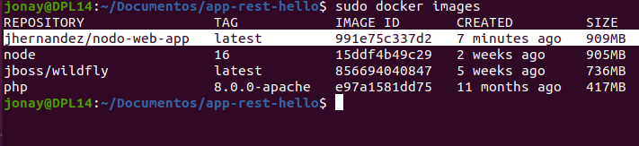


Vemos que tenemos la imagen creado y lista para ser usada.


## 4. Lanzar el contenedor
Ahora que ya tenemos la imagen vamos a crear el contenedor. Para ello vamos a usar el comando run de docker.
```
docker rub p 8080:8080 d jhernandez/nodowebapp 
```

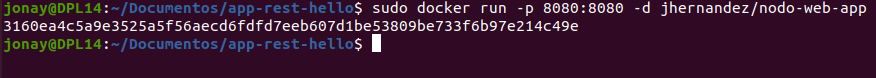


Y ahora vamos a comprobar que el contenedor esta creado con el comando de docker ps.
```
docker ps
```

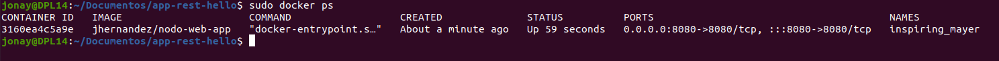


Otra comprobación que podemos hacer el comprobar los logs para verificar que no ha habido ningún error.
```
docker logs idContenedor
```

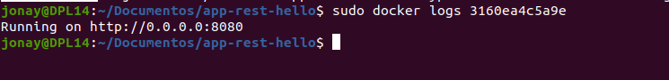


Y por ultimo vamos a realizar un petición.
```
curl -i localhost:8080
```

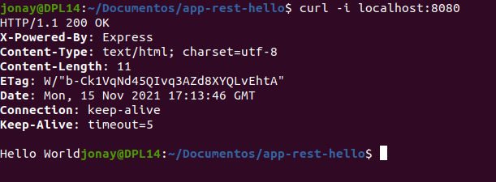
