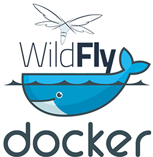
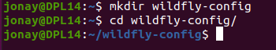
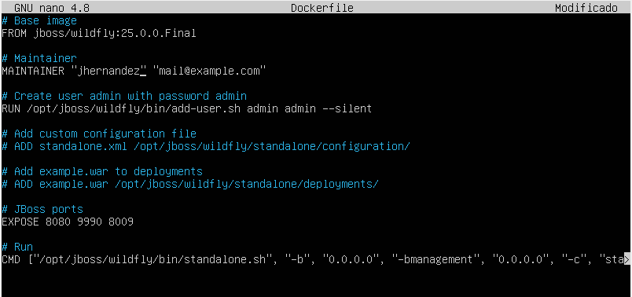
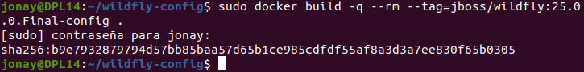
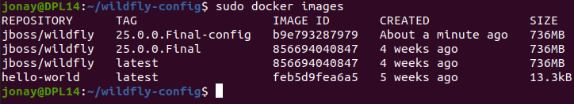
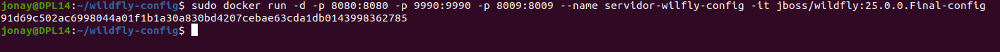
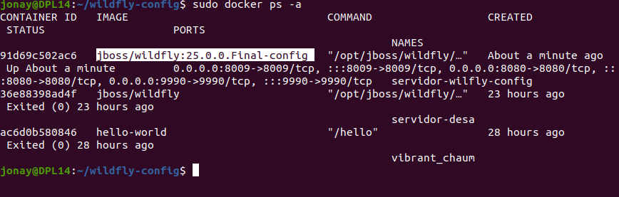
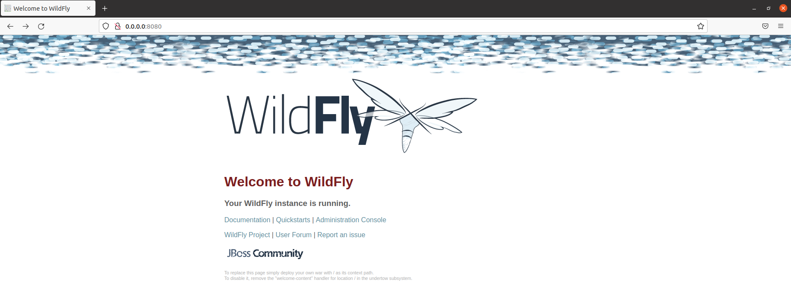
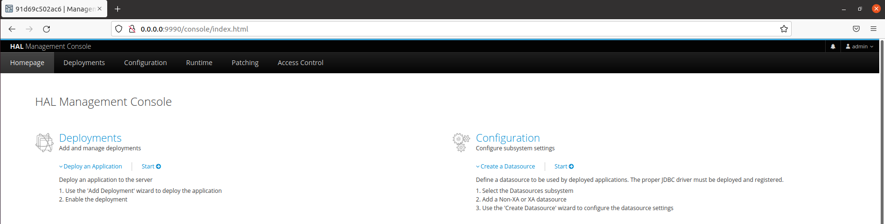

# Dockerizar WildFly



## 1. Introducción.

Con Doker aparte de lanzar contenedores usando imágenes del repositorio de Dokcer, Docker Hub, podemos crear nuestras propias imagenes para luego lanzar un contenedores totalmente personalizados.

En esta guía vamos a ver como crear una imagen personalizada a partir de la imagen de WildFly que realizamos en el anterior ejemplo WildFly en Docker .

## 2. Fichero dockerfile.
Para crear una imagen personalizada vamos a crear una carpeta de trabajo y en ella vamos a configurar un fichero Dockerfile donde añadiremos la configuraciones que queremos que tenga nuestra imagen.

Primero creamos el directorio de trabajo.
```
mkdir wildfly-config
cd wildfly-config
```




Ahora creamos el fichero Dockerfile con la siguiente información.
```
nano Dockerfile
```

Con la siguiente información.
```
# Base image
FROM jboss/wildfly:25.0.0.Final

# Maintainer
MAINTAINER "jpexposito" "mail@example.com"

# Create user admin with password admin
RUN /opt/jboss/wildfly/bin/add-user.sh admin admin --silent

# Add custom configuration file
# ADD standalone.xml /opt/jboss/wildfly/standalone/configuration/

# Add example.war to deployments
# ADD example.war /opt/jboss/wildfly/standalone/deployments/

# JBoss ports
EXPOSE 8080 9990 8009

# Run
CMD ["/opt/jboss/wildfly/bin/standalone.sh", "-b", "0.0.0.0", "-bmanagement", "0.0.0.0", "-c", "standalone.xml"]

```




Con esto ya tenemos el fichero de configuración, hora tenemos de crear la imagen con docker para ello usamos el siguiente comando. Cuidado con el punto del final que es obligatorio. 
```
sudo docker build -q --rm --tag=jboss/wildfly:25.0.0.Final-config .
```




Comprobamos si existe la imagen usando:
```
sudo docker images
```




## 3. Usar la imagen.
Ahora para hacer uso de la imágenes vamos a lanzar este comando siguiendo lo especificado en el dockerfile y teniendo en cuenta --name servidor-wilfly-config  que debe ser significativo.
```
sudo docker run -d -p 8080:8080 -p 9990:9990 -p 8009:8009 --name servidor-wilfly-config -it jboss/wildfly:25.0.0.Final-config
```




Para comprobar los contenedores que están activos y los que no usamos.
```
sudo docker ps -a
```




Verificamos que en contenedor esta arrancado accediendo por su IP.




Comprobamos que la configuración funciona y accedemos a la consola de administración con el usuario y contraseña.


