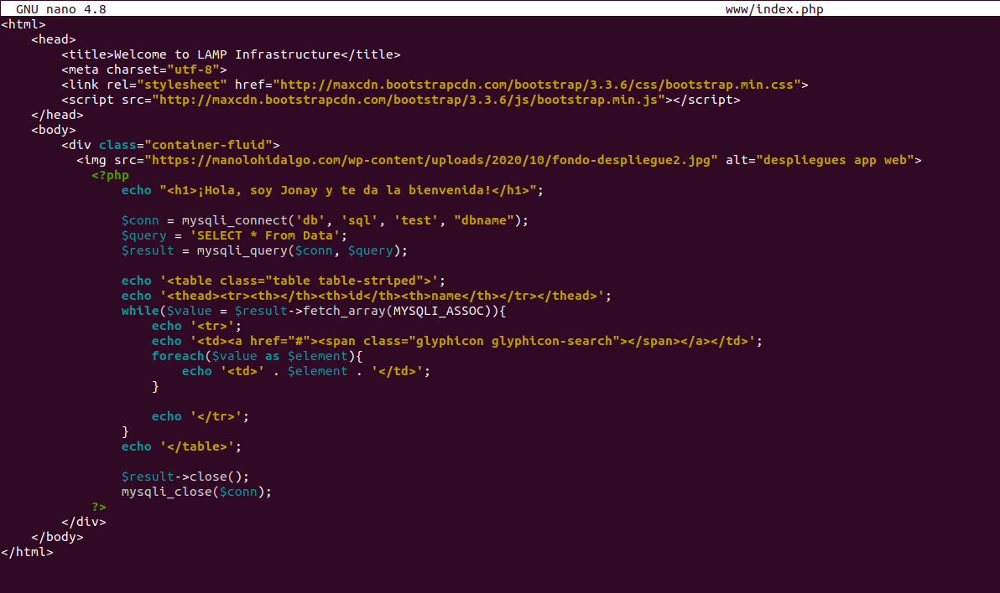

# Infraestructura LAMP con Docker


## 1. Introducción.
En esta guía se quiere crear un LAMP usando Docker. Para ello tenemos que construir una infraestructura formada por un Apache, una base de datos y PHP. Con Docker vamos a crear 3 contenedores, uno con Apache y PHP que crearemos un imagen propia con el fichero Dockerfile, otro con la base de datos y por ultimo un contenedor con PhpMyAdmin.

Estructura que tendrá el LAMP.


## 2. Crear Infraestructura.
Vamos a ir poco a poco, primero creamos los directorios que vimos en la imagen de arriba. Con estas carpetas crear en la raíz del proyecto vamos a crear el fichero Dockerfile.
Este fichero Dockerfile sera el que crear una imagen personalizada con Apache y PHP con las configuración que vemos.


En el mismo sitio creamos el fichero **docker-compose.yml** con la siguiente información.


Como vemos:
    • **www**: contenedor de apache y php que se crear a partir de la imagen que también se creara con el fichero Dockerfile.
    • **db**: contenedor con la base de datos que usa la imagen mysql:8.0
    • **phpmyadmin**: contenedor tiene phpmyadmin.

Ahora vamos a crear el fichero **dbname.sql** en **dump/**, que es fichero con la base de datos que vamos a usar.


Y ahora vamos a crear el fichero **index.php** en **www**, este fichero sera la pagina web que accederá a la base de datos y mostrar los campos que tiene.




## 3. Lanzar contenedores.
Con la infraestructura creada vamos a proceder con la creación con los contenedores.
Lanzamos los contenedores con el siguiente comando.
```
sudo docker-compose up -d
```


Con esto vamos a realizar un "docker ps" para ver los contenedores que tenemos activos.
```
sudo docker-compose ps
```


Como vimos en el "docker ps" si accedemos en el navegador por el puerto veremos la pagina y el PhpMyAdmin.

Página web.


PhpMyAdmin y ponemos el usuario y contraseña.


Para parar nuestra infraestructura usamos el siguiente comando.
```
sudo docker-compose stop
```

