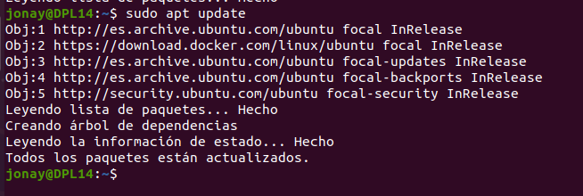

# Docker


## 1. Introducción.
En esta guiá vamos a ver como instalar la herramienta Docker en un sistema Ubuntu 20,04.

Docker es un proyecto de código abierto que automatiza el despliegue de aplicaciones dentro de contenedores de software, proporcionando una capa adicional de abstracción y automatización de virtualización de aplicaciones en múltiples sistemas operativos. 
Algunas ventajas son: 
    • Retorno de la inversión y ahorro de costos. 
    • Estandarización y productividad. 
    • Eficiencia de CI. 
    • Compatibilidad y mantenibilidad. 
    • Simplicidad y configuraciones más rápidas. 
    • Despliegue rápido. 
    • Despliegue continuo y pruebas 

2. Instalación.

Para comenzar es recomendable haber realizado un actualización del sistema y una actualización de los paquetes de Ubuntu.
```
sudo apt upgrade && sudo apt update
```


Luego añadimos algunos paquete para que podamos usar paquetes por HTTPS con apt.
```
sudo apt install apt-transport-https ca-certificates curl software-properties-common
```


Ahora vamos a añadir la clave GPG  en el sistema para el repositorio oficial de Docker.
```
curl -fsSL https://download.docker.com/linux/ubuntu/gpg | sudo apt-key add -
```


Agregamos el repositorio de Docker.
```
sudo add-apt-repository "deb [arch=amd64] https://download.docker.com/linux/ubuntu focal stable"
```


Al terminar esto actualizamos los paquetes de Ubuntu.
```
sudo apt update
```



Ahora vamos a realizar un comando para ver si vamos a instalar el repositorio de Docker en lugar del repositorio predeterminado del sistema.
```
apt-cache policy docker-ce
```


Ahora instalamos Docker.
```
sudo apt install docker-ce
```


Ahora que tenemos instalado Docker no solo tenemos disponible el servicio de Docker si no la utilidad de linea de comandos de Docker.

Con systemctl podemos ver que el servicio Docker esta totalmente operativo.
```
sudo systemctl status docker
```


3. Trabar y administrar contenedores.
Hay que saber que los contenedores se construyen con imágenes. Por defecto estas imágenes se obtiene de Docker Hub, un repositorio de imágenes gestionado por los responsables de Docker. Pero Docker también permite que creemos y usemos nuestras propias imágenes.

Vamos a crear un contenedor usando una imagen que descarga de Docker Hub.
```
docker run hello-world
```


Ahora vamos a ver una serie de comandos que nos ayudaran a consultar y trabajar con contenedores.

Comando para consultar los contenedores activos.
```
sudo docker ps
```


Para ver todos los contenedores activos e inactivos.
```
docker ps -a
```


Para ver el ultimo contenedor que se creo usamos.
```
docker ps -l
```


Para listar imágenes de Docker.
```
sudo docker images
```

