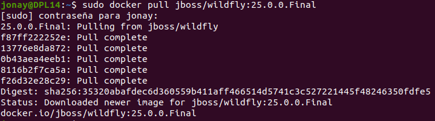
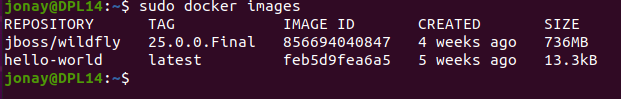
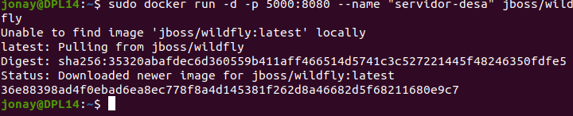
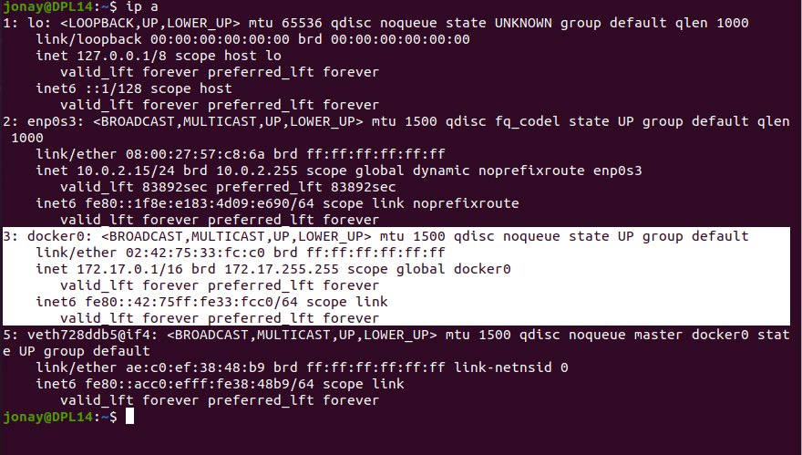
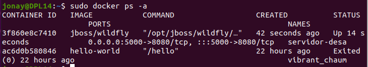
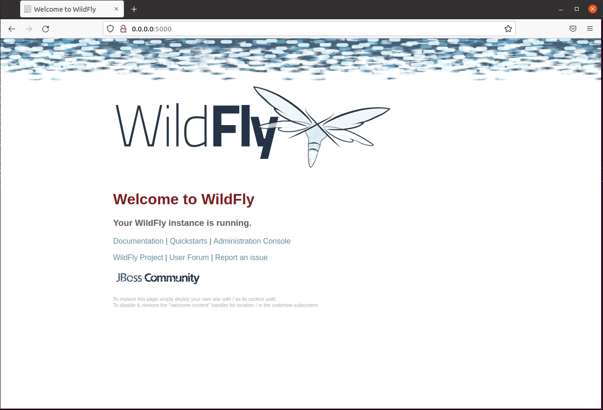

# WildFly en Docker


## 1. Introducción.
En esta guiá veremos como instalar Wildfly en un contenedor de Docker. Todo esto se realizara en una maquina Ubuntu 20.04.

## 2. Instalación de WildFly.
Primero como sabemos Docker trabaja con imagenes que usa para crear el contenedor. En este caso se va a descarga en concreto la version 20.0.0.Final de la imagen de WildFly oficial. Para esto va a hacer sudo del tag.
```
sudo docker pull jboss/wildfly:25.0.0.Final
```




Ahora vamos las imágenes que tenemos descargadas.
```
sudo docker images
```




Con la imagen descarga vamos a arrancar el contenedor de Docker.
```
sudo docker run -d -p 5000:8080 --name "servidor-desa" jboss/wildfly
```




Vamos a consultar las tarjetas de red par ver que el contenedor de Docker esta conectado y tiene una IP. Con esta IP podemos acceder al contener y ver la instalación de WildFly.
```
ip a
```




Lo mas recomendable es acceder y ver los contenedores conectados con el comando “docker ps -a ” y si miramos veremos el puerto con el que se acceder y la redirección de puertos que tiene.



Si accedemos veríamos algo como lo siguiente.

