# Modificando y Clusterizando un servicio REST en WildFly

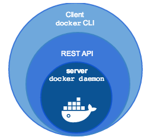


## 1. Introducción.
En esta guiá se va a usar lo aprendido en las guiás anteriores. Vamos a  contruir un entorno [LAMP](https://github.com/lawd17/docker/blob/main/infraestructura_LAMP_docker/infraestructura_LAMP_docker.md) y desplegar una **api REST** que requiere **WildFly**.

Y para darle a nuesta app mejores tiempos de respuesta y robustez, crearemos 3 contenedores WildFly en cluster.

## 2. Preparar el entorno.
Primer vamos a descargar la imagen oficial de WildFly.
```
sudo docker pull jboss/wildfly:25.0.0.Final
```

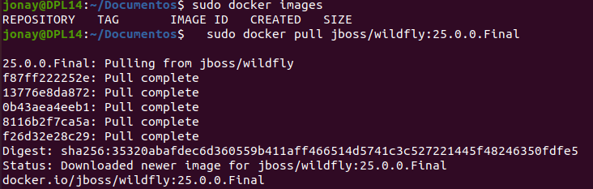


Comprobamos que hemos descargado la imagen correctamente.

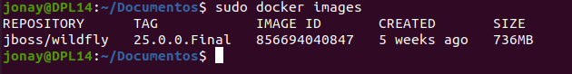


Vamos crear la carpeta donde tendremos todo el entorno, en nuestro caso la hemos llamado “app-rest-hello”.
```
mkdir app-rest-hello
```


Ahora vamos crear un entrono igual que en la guiá de [LAMP](https://github.com/lawd17/docker/blob/main/infraestructura_LAMP_docker/infraestructura_LAMP_docker.md). Para que puedes desarrollar el entorno aquí te dejamos como quedara la estructura del proyecto.

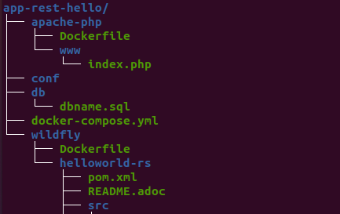


Los directorio de la estructura son:
- *apache-php: este es el directorio del contenedor de APACHE + PHP donde estará el fichero Dockerfile para crear su imagen y la carpeta www que contendran las web que se moverán al contenedor.
- conf:  en este directorio irán configuraciones de mysql que se moverán a conf.d al crear el contenedor.
- db: aquí tenemos el .sql con la base de datos que se añadirá al contenedor de mysql.
- Wildfly: aquí tenemos el Dockerfile que crear la imagen que usaran los tres contenedores de wildfly ademas de helloworld-rs que es la api REST.

## 3. Apache + PHP.
Este contenedor es el mismo que usamos en la practica [LAMP](https://github.com/lawd17/docker/blob/main/infraestructura_LAMP_docker/infraestructura_LAMP_docker.md).

**Dockerfile**
```
FROM php:8.0.0-apache
ARG DEBIAN_FRONTEND=noninteractive
RUN docker-php-ext-install mysqli
RUN apt-get update \
    && apt-get install -y libzip-dev \
    && apt-get install -y zlib1g-dev \
    && rm -rf /var/lib/apt/lists/* \
    && docker-php-ext-install zip
RUN a2enmod rewrite
```

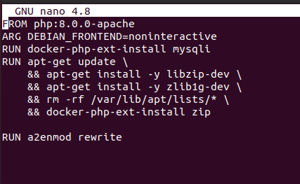


El fichero **index.php** sera un fichero básico que mostrara la información del la base de datos solo con la intención de verificar que la base de datos esta operativa.

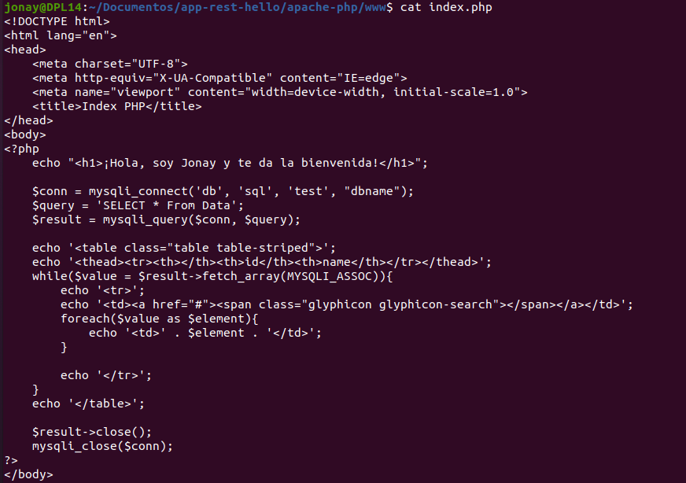


Y por ultimo la configuración del contenedor en el fichero **docker-compose.yml** .

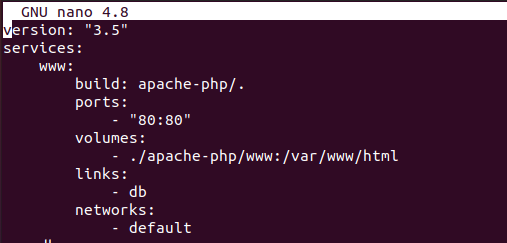


## 4. Base de datos.
Mismo proceso que ya se ha explicado en la practica LAMP.
Declaración del contenedor **db** en el fichero **docker-compose.yml** .

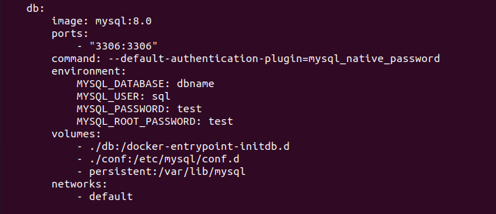


## 5. Contenedor WildFly.
Con los contenedores WildFly vamos a crear el fichero **Dockerfile** con la configuración personalizada dentro de la carpeta wildfly. Esto nos creara una imagen que sera la que usen los tres contenedores que vamos a crear.

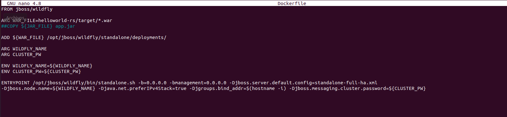


Contenedores en el fichero docker-compose.yml

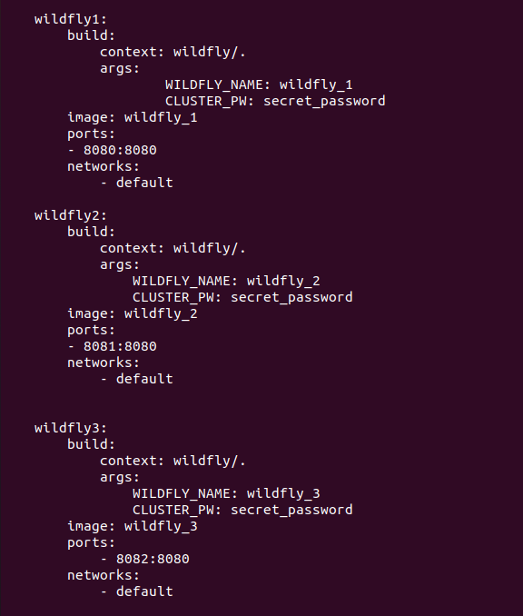


El siguiente paso es descargar la aplicación Rest que se va a usar, en este caso hemos usado [helloworld-rs](https://github.com/wildfly/quickstart/tree/main/helloworld-rs). Cuando descargues la app y la coloques dentro de la carpeta wildfly, hay que lanzar el siguiente comando dentro de la carpeta de la app.
```
mvn clean install
```

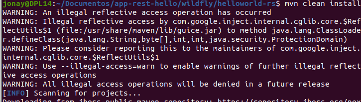


Esto nos creara la carpeta **target** y en esta, el archivo WAR, que al crear el contenedor se moverá a wildfly para que pueda desplegar la aplicación.

## ## 6. PhpMyAdmin.
Por ultimo nos que prepara el contenedor para PhpMyAdmin en el fichero docker-compose.yml .

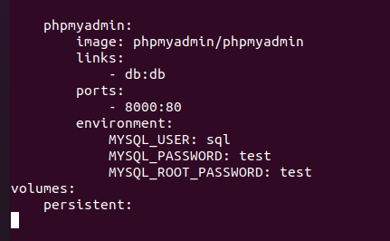


## 7. Desplegar el entorno.
Ya habiendo realizado todos los pasos anteriores solo nos queda desplegar el entorno usando los comando de docker.
```
sudo docker-compose up -d (-d para lanzarlo en segundo plano)
```

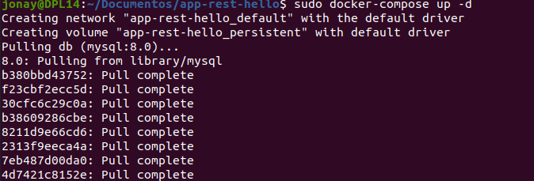


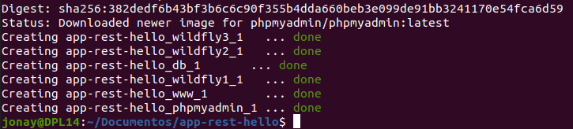


Ahora que tenemos el entorno preparado vamos a ver los contenedores que hay desplegados.
```
sudo docker ps -a
```

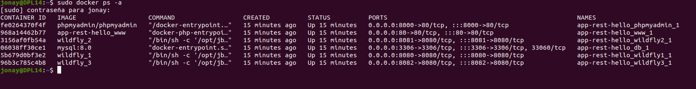


Y también echemos un vistazo a l as imágenes.

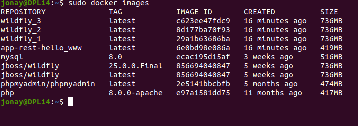


Para comprobar la a aplicaciones vamos a acceder a uno de los contenedores de wildfly, para ello podemos:

- WildFly1 : http://localhost:8080/helloworld-rs
- WildFly2 : http://localhost:8081/helloworld-rs
- WildFly3 : http://localhost:8082/helloworld-rs
    
Cualquiera de estos nos debería mostrar la siguiente página.
**WildFly1**

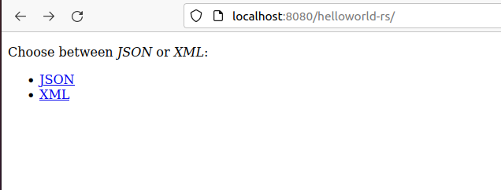


**WildFly2**

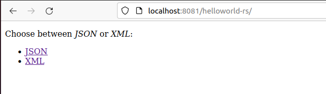


**WildFly3**

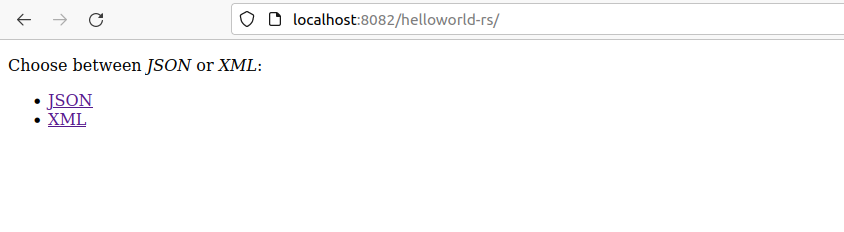


Ahora como vemos si apretamos en algunos de los enlace varemos algo como.

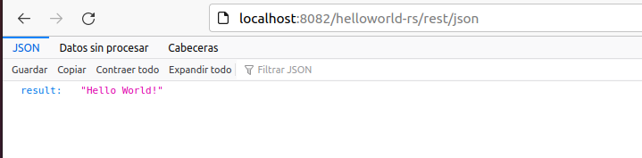


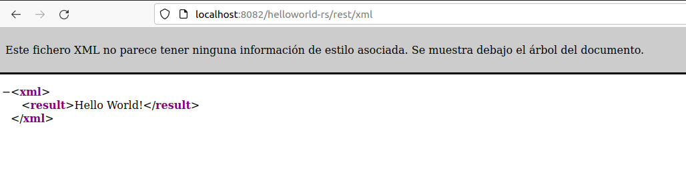


Y si quieres puedes comprobar si el resto de contenedores esta funcionando. Para ellos solo accede por ip correspondiente.
**PhpMyAdmin → puerto 8000**

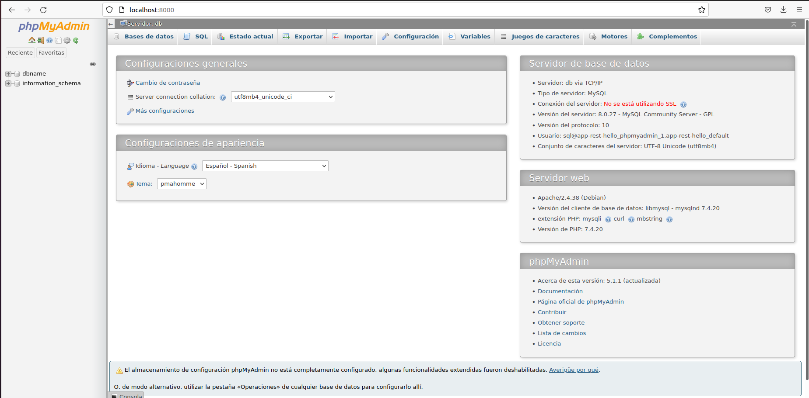


**Apache → puerto 80**

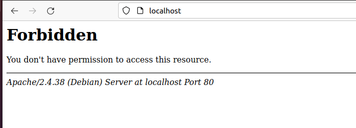


Y con esto tenemos nuestro entorno desplegado y funcional. 


## 8. EXTRA.
En este apartado vamos a modificar un poco el entorno, primero vamos a añadir la opción para que la **app hello-rs** puede devolver un objeto en formato JSON y luego vamos a crear un fichero php para poder mostrar datos de la base de datos .

Para esto vamos a crear una clase Libro que sera nuestro objeto a devolver.
Clase básica libro.


Y el método nuevo.

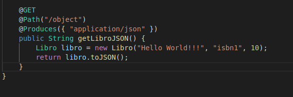


Ademas vamos a crear el index.php dentro de www para que Apache pueda mostrarlo, esto ya lo realizamos al principio, en caso contrario crearlo.


Y con esto cambiamos también el index.jsp para poder mandar la petición. También se le ha añadido la opción de redireccionar a la página de php con la que se accederá a la base de datos que hemos realizado en www.

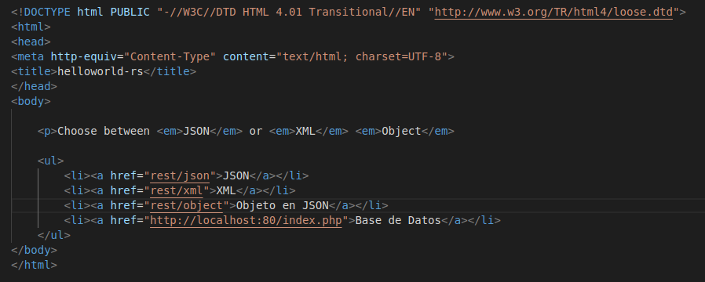


Con esto vamos a tener que realizar un “mvn clean install” y volver a levantar el entrono para que apliquen los nuevos cambios.

Con esto realizado nos queda comprobar si esto funciona para ello accedemos tanto al apache como a la nueva página de la aplicación Rest.

**Página jsp de la aplicación** .

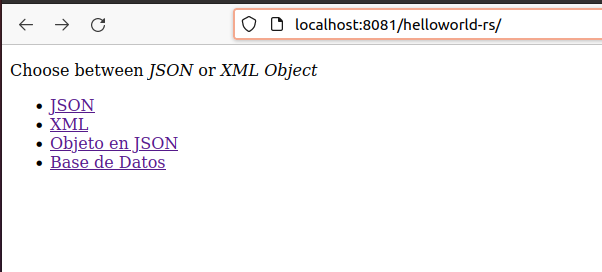


**Obteniendo a un objeto**.

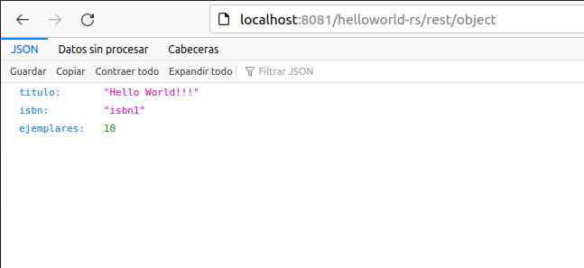


**Página de base de datos**.

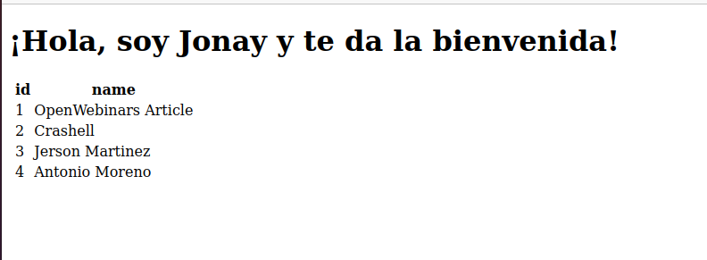
